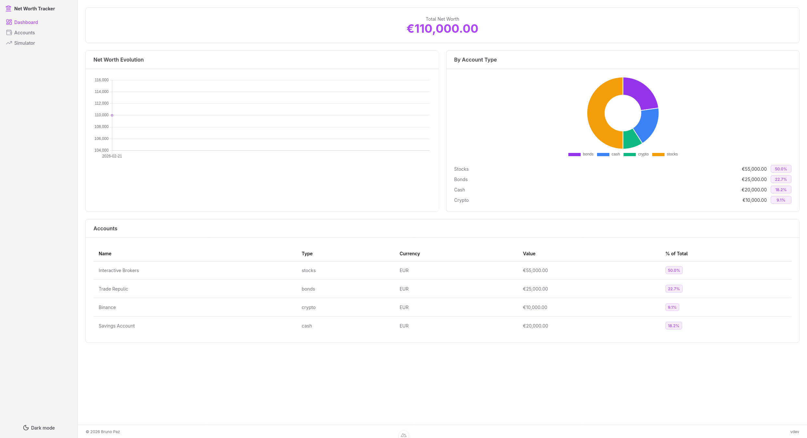
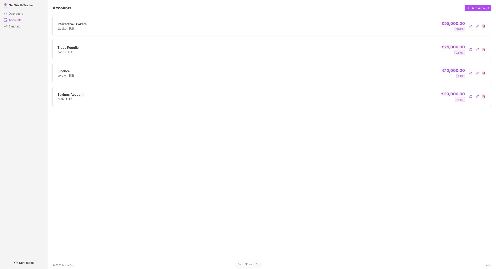
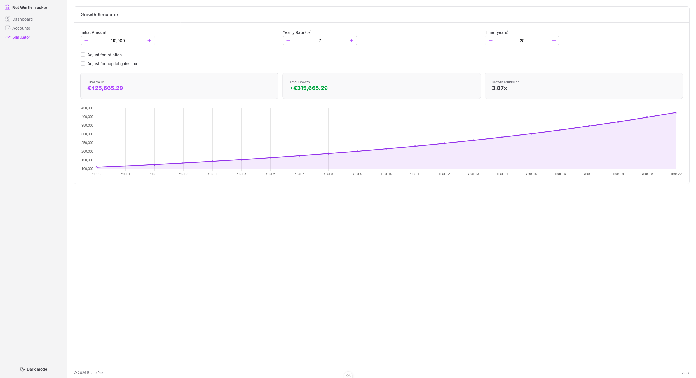

# Net Worth Tracker

> A simple net worth tracking application built with [Nuxt](https://nuxt.com/) and [Nuxt UI](https://nuxt.com/ui), with SQLite for data storage. Track accounts, record value snapshots over time, visualise growth, and simulate compound interest projections.

<div align="center">

[](https://github.com/brpaz/networth-tracker/actions/workflows/ci.yml)
[](https://github.com/brpaz/networth-tracker/pkgs/container/networth-tracker)
[](https://nodejs.org/)
[](https://nuxt.com/)
[](./LICENSE.md)
[](https://brpaz.github.io/networth-tracker/)

</div>

## 🎯 Motivation

I tried a bunch of different personal finance apps, but all of them were overly complex. I didn´t want to have to manually keep track of all transactions, just to have a global view of my finances. I just wanted a simple app, where I could keep track and visualize my total net worth over time.

## 🗃️ Features

- **Account Management** - Create and manage accounts across types: stocks, cash, crypto, real estate, bonds, retirement, and other.
- **Value History** - Record total value snapshots per account. Full history is preserved to track evolution over time.
- **Dashboard Charts** - Net worth evolution line chart and account type breakdown donut chart using Chart.js library.
- **Growth Simulator** - Compound interest calculator with configurable initial amount, yearly rate, and time horizon. Includes projected growth chart.
- **Single-user** - No authentication required. Data stored locally in SQLite.

## 🖼️ Screenshots

| Dashboard                                      | Accounts                                     | Growth Simulator                               |
| ---------------------------------------------- | -------------------------------------------- | ---------------------------------------------- |
|  |  |  |

## 🚀 Quick Start

```bash
docker volume create networth-data

docker run -d \
  --name networth-tracker \
  -p 3000:3000 \
  -v networth-data:/app/data \
  ghcr.io/brpaz/networth-tracker:latest
```

The app will be available at [http://localhost:3000](http://localhost:3000).

For Docker Compose setup, configuration options, upgrade and backup instructions, see the **[Getting Started guide](./docs/getting-started.md)** or the published [documentation site](https://brpaz.github.io/networth-tracker/).

## 🏗️ Development

See the **[Development Environment guide](./docs/development.md)** for full setup instructions.

## 🤝 Contributing

This project was developed to scratch a personal itch. It's a personal project, and thus I plan to keep it limited in terms of features.

Still, I'm open to contributions that align with my vision and goals for the project. If you have an idea or feature request, please open an issue or submit a pull request.

Please read the [CONTRIBUTING.md](CONTRIBUTING.md) file for details on how to contribute to this project.

## 🙋 Contributors

- Bruno Paz <oss@brunopaz.dev>

## 📝 License

This project is licensed under the MIT License. Check the [LICENSE](LICENSE) file for details.
